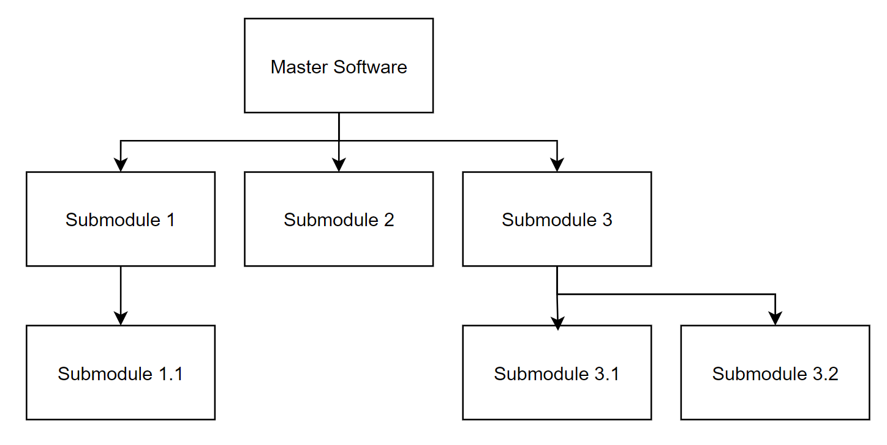

# master-software
## software structure
This repository is the master software module that has submodules as dependency. Below is the provided structure of dependant modules visualised:

## File structure 
Each module has the following key files:
- <module_name>.c -> a simple c file that prints hello from the module
- test_<module_name>.cpp -> a simple c++ test file that uses GTest to verify output from the c file
- CMakeLists.txt -> a txt file that contains sety of directives and targets that will be used by CMake to build

## Execution
All modules are compilable with CMake. To run a module independantly:

- `mkdir build && cd build`
- `cmake ..`
- `make`
- `./<executable>`
- `ctest --verbose`

This builds the module and runs and tests the module itself any dependant module

Currently, the version that is being built using CMake in CI is `v1.0.2`. All test logs and build binaries are written to `build/` and can be downloaded

## Scripts
The key scripts can be found in this directory (master-software) and need to be only executed here as they recursively go through all modules and perform the same action. The scripts are:
- `tag_all_repos.sh` -> tags all the modules recursively with a specific tag that can be passed as an argument
- `check_out_tags.sh` -> check out a specific version of module which can be passed as an argument; This is necessary as we build the overall software using the version tag as reference
- `build_all.sh` -> builds all the modules and is stored in `build/`
- `store_binaries.sh` -> copies binaries and stores it separately in the same `build/` dir
- `run_tests.sh` -> triggers the unit tests in the dependency order and stores test log in `build`

The scripts are executed in the `.github/workflows/ci.yaml` file which is allows for CI when pushed onto github. More information of each build can be found in actions tab of the repository